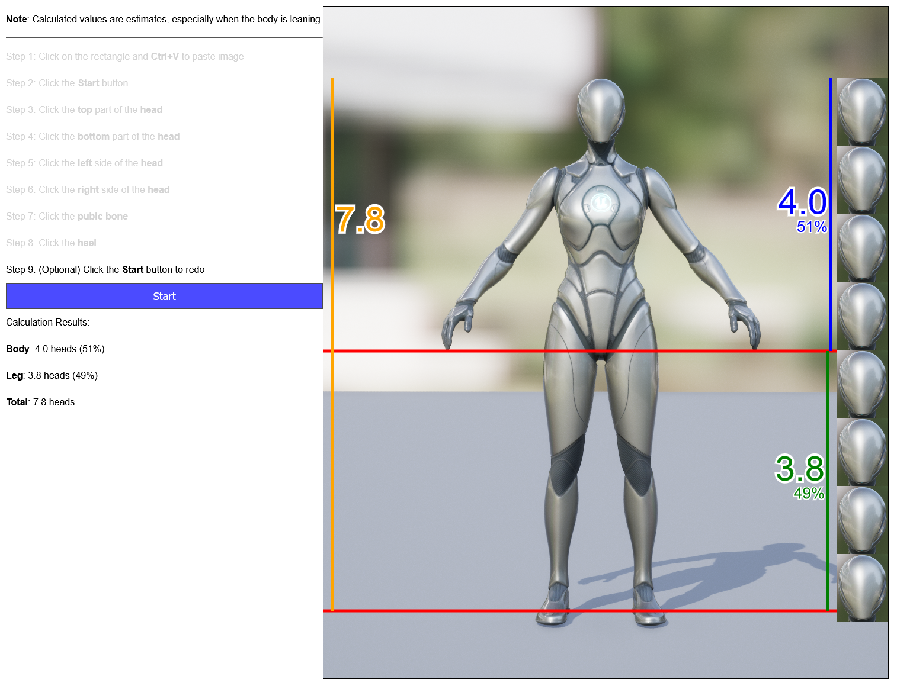

# Body Proportion Analyzer
Calculate the leg-to-body ratio given the input character image and user inputs.



## Working Demo
https://www.youtube.com/watch?v=qlQGHstHjL4

## Try It Out
https://hyssopi.github.io/Body-Proportion-Analyzer/

## Prerequisites
`Node.js` and `npm` required to build.

## Build
```
npm install
npm run clean
npm run build
npm run lint
```

## Run
Open `index.html` in a web browser.

## Test
(None)
